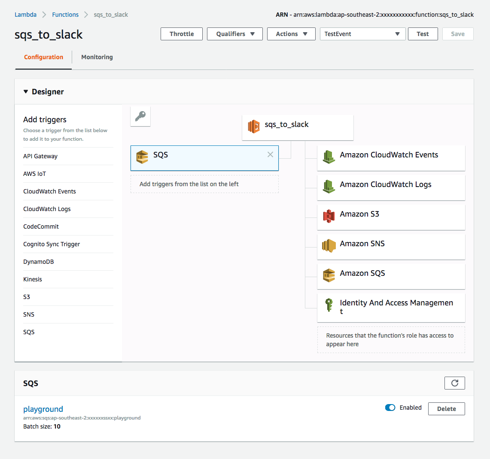
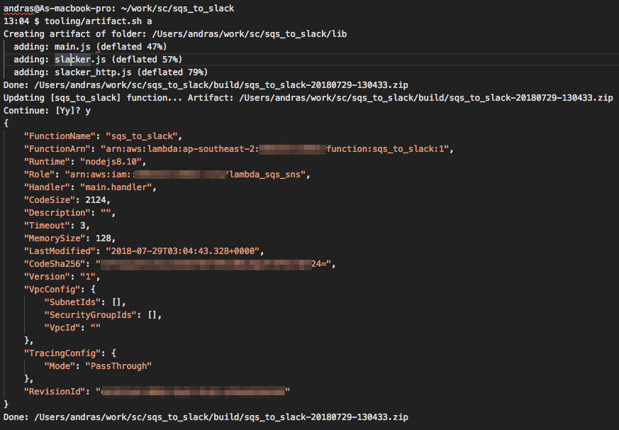
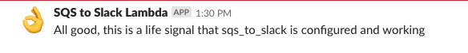

# AWS SQS -> Slack proxy

Forwards messages from sqs queue to slack channel.

## Prerequisites

* Slack webhook

Set webhook_url and CHANNEL to the one provided by Slack when you [create the webhook]( https://my.slack.com/services/new/incoming-webhook/).

* Configured lambda function with SQS trigger and necessary permissions



## Install dependencies

`yarn install`

## Create artifact

Utilize `tooling/artifact.sh` script to
 - create artifact zip
 - create artifact zip and upload it to aws
 - upload any zip to aws

Run `tooling/artifact.sh` without parameters for help screen.

 ```
13:20 $ tooling/artifact.sh

Usage:

tooling/artifact.sh a|p <filepath>|z 

	a: creates zip file in build folder as sqs_to_slack-20180929-132134.zip and publishes it to aws sqs_to_slack lambda function after confirmation
	p <filepath>: publishes given file to aws sqs_to_slack function
	z: creates zip file in build folder as sqs_to_slack-20180929-132134.zip

Note: this script assumes that the lambda function name is identical to the project root folder name 
 ```

### Successful zip and upload output




## Invoke deployed aws lambda function

Run `tooling/invoke.sh life_signal.json`. 
`invoke.sh` takes one parameter which must be a valid json file in `tooling/events` folder. 

Assuming `life_signal.json` content is the below json, the script will post a message to coinfugured slack channel
```
{ "Records":
    [ 
        { 
            "messageId": "d1fa0cfa-3ac3-4d99-9daf-802cedb654e8",
            "receiptHandle": "AasdadadDd/UcUj0nILZ6HHZR1hT0GisO2qrhl+ncjQouYUGpIEUSWxE86gE2KA==",
            "body" : "{\"text\": \"All good, this is a life signal that sqs_to_slack is configured and working\",\n \"username\": \"SQS to Slack Lambda\",\n \"icon_emoji\": \":ok_hand:\",\n \"webhook_url\": \"https://hooks.slack.com/services/xxxxxxx/yyyyyyyyyyyyyyyyy\",\n \"channel\": \"#playground\"\n}\n",
            "messageAttributes": {},
            "eventSource": "aws:sqs",
            "eventSourceARN": "arn:aws:sqs:   ap-southeast-2:686332113963:sqs_playground_channel",
            "awsRegion": "ap-southeast-2" 
        }
    ] 
}
```

### Posted message



## Invoke function locally

Run `tooling/invoke_local.sh life_signal.json`. 
`invoke.sh` takes one parameter which must be a valid json file in `tooling/events` folder. 


Note: the above `invoke*.sh` scripts are for developers only. Run them at your own risk, no sanity checks have been implemented.
